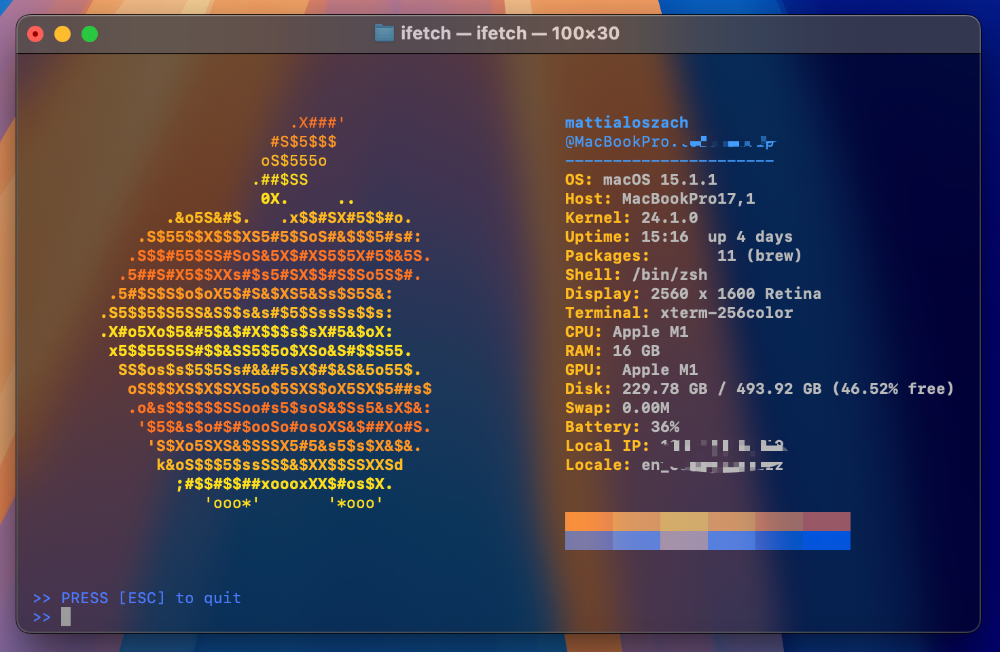
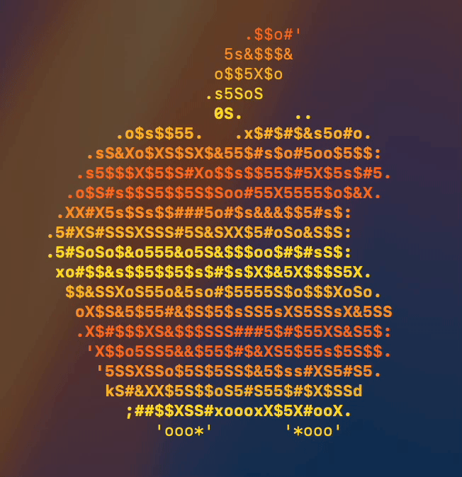

# iFetch
Fast System-Information tool for macOS (inspired by fastfetch/neofetch)



## Overview
**iFetch** is a lightweight and animated system fetch tool for macOS, implemented in C++. It's similar to `neofetch`, but with an elegant Apple-inspired ASCII logo and animated color bars. It provides detailed system information, including CPU, RAM, GPU, OS version, uptime, and more. There's a static and dynamic version.



## Features
- 🚀 **Fast execution** - Optimized for speed
- 🎨 **Stylish appearance** - ANSI color support for a sleek output with macOS Sequoia style
- 🍏 **Apple-inspired ASCII logo** - With randomized animation
- 🖥️ **Displays key system information** - OS, kernel, uptime, hardware, battery, and more
- ⏳ **Updates system info dynamically** - Refreshes automatically every 120 seconds
- ⌨️ **Keyboard interaction** - Press `[ESC]` or `q` to exit

## Installation
You can use `iFetch` in two ways: **locally** or **globally**.
First make sure to download the repo.

### 1. Local Execution
If you prefer to run `iFetch` only in the current directory, simply navigate to its location and execute:
```bash
./ifetch
```

### 2. Global Installation (Recommended)
To make `iFetch` available as a system-wide command, move it to `/usr/local/bin/`:
```bash
sudo mv ifetch /usr/local/bin/
sudo chmod +x /usr/local/bin/ifetch
```
Now, you can run `iFetch` from anywhere by typing:
```bash
ifetch
```

## Usage
Simply open a terminal and run:
```bash
ifetch
```
Press `[ESC]` or `q` to exit the animated display.

## Static vs. Dynamic Version
There are two versions of `iFetch`:
- **Static Version:** Displays system information and an Apple ASCII logo without animation.
- **Dynamic Version:** Includes an animated logo and color bars for a more interactive experience.

## Compatibility
- macOS only (tested on macOS Ventura & Monterey)
- Requires a terminal with **ANSI color support**

## Updates
- This is the first version
- Updates/optimizations will follow soon

## License
MIT License. Feel free to modify and improve! 🚀
